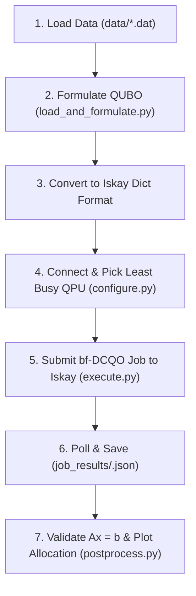

# Market-Split-Problem

Solving the **Market Split Problem** (from the QOBLIB benchmark) using **Kipu Quantum's Iskay Optimizer** (a Qiskit Function implementing the bias-field counterdiabatic quantum optimization / bf-DCQO algorithm on IBM Quantum hardware).

---

## 📌 Problem Overview

The **Market Split Problem** is an NP-hard combinatorial optimization challenge where a company needs to divide $n$ markets between two commercial divisions (Region A and Region B) such that the total sales for each of $m$ products in Region A matches a target vector $b$.

Mathematically:
$$\text{Find } x \in \{0, 1\}^n \quad \text{such that} \quad A x = b$$
- $A \in \mathbb{Z}^{m \times n}$: Matrix where element $A_{ij}$ is the sales volume of product $i$ in market $j$.
- $x \in \{0, 1\}^n$: Binary decision vector ($x_j = 1$ if market $j$ is assigned to Region A, $0$ if Region B).
- $b \in \mathbb{Z}^m$: Target sales per product for Region A (typically 50% of total company sales).

---

## 📂 Project Structure & File Descriptions

```text
Market-Split-Problem/
│
├── data/
│   └── ms_03_200_177.dat        # QOBLIB benchmark instance (3 products, 20 markets)
├── job_results/                 # Output folder for quantum JSON results and PNG plots
│
├── load_and_formulate.py        # Step 1: Data parsing & QUBO formulation
├── configure.py                 # Step 2: Credentials & automated backend selection
├── execute.py                   # Step 3: Job submission, polling & result retrieval
├── postprocess.py               # Step 4: Solution extraction, validation & visualization
├── simulate_run.py              # Offline simulation & testing pipeline
│
├── main.py                      # Master orchestrator script (executes Steps 1 to 4)
├── requirements.txt             # Python dependencies
├── msplit/                      # Python virtual environment
└── README.md                    # Project documentation
```

### File Breakdown

| File | Purpose & Key Functionality |
| :--- | :--- |
| **`load_and_formulate.py`** | • Parses `.dat` benchmark instances into matrix $A$ and vector $b$.<br>• Uses `qiskit_addon_opt_mapper` to convert equality constraints ($Ax = b$) into an unconstrained QUBO penalty model.<br>• Transforms QUBO terms into Kipu's Iskay dictionary schema: `{"()": const, "(i, )": lin, "(i, j)": quad}`. |
| **`configure.py`** | • Manages IBM Quantum API token and IBM Cloud Instance CRN credentials.<br>• Contains `get_least_busy_backend()` to query IBM Quantum via `QiskitRuntimeService` and dynamically select the operational QPU with $\ge 20$ qubits and shortest queue. |
| **`execute.py`** | • Connects to the **IBM Qiskit Functions Catalog** and loads `kipu-quantum/iskay-quantum-optimizer`.<br>• Configures bf-DCQO parameters (iterations, shots, preprocessing/transpilation levels).<br>• Submits the job, live-polls status (`PENDING` → `RUNNING` → `DONE`), and caches output to `job_results/<timestamp>.json`. |
| **`postprocess.py`** | • Automatically detects and loads the most recent result in `job_results/`.<br>• Extracts optimal bitstrings and verifies constraint fulfillment ($Ax = b$).<br>• Generates and saves a `matplotlib` bar chart comparing Region A vs. Region B allocations against the target lines. |
| **`simulate_run.py`** | • Offline fallback tool that solves the problem instance classically and simulates the Iskay JSON response format.<br>• Directly invokes `postprocess.py` to validate outputs and generate charts without requiring active IBM hardware access. |
| **`main.py`** | • The main entrypoint. Chaining steps 1–4 together into an automated pipeline with timestamped outputs. |

---

## 🔄 End-to-End Workflow



---

## 🚀 How to Run

### 1. Environment Setup
Activate the virtual environment and ensure dependencies are installed:
```bash
source msplit/bin/activate
pip install -r requirements.txt
```

### 2. Configure Credentials (for Quantum Hardware Run)
Open [`configure.py`](configure.py) and paste your IBM Quantum API token and IBM Cloud Instance CRN:
```python
def get_credentials():
    return {
        "token": "YOUR_IBM_QUANTUM_API_TOKEN",
        "instance": "YOUR_IBM_CLOUD_INSTANCE_CRN",
    }
```

### 3. Run on Quantum Hardware
Run the complete end-to-end quantum pipeline:
```bash
python main.py
```
*The script will parse the problem, find the optimal QPU, submit the job to Kipu Iskay, poll until completion, validate the solution, and save the allocation plot under `job_results/`.*

### 4. Run Offline Simulation (No QPU / Entitlement Needed)
If you do not have an active Qiskit Functions entitlement for Kipu Iskay or wish to test offline:
```bash
python simulate_run.py
```
*This generates a synthetic execution payload, verifies $Ax = b$, and renders the allocation chart instantly.*
